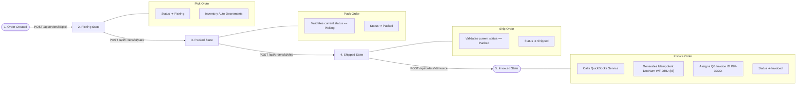
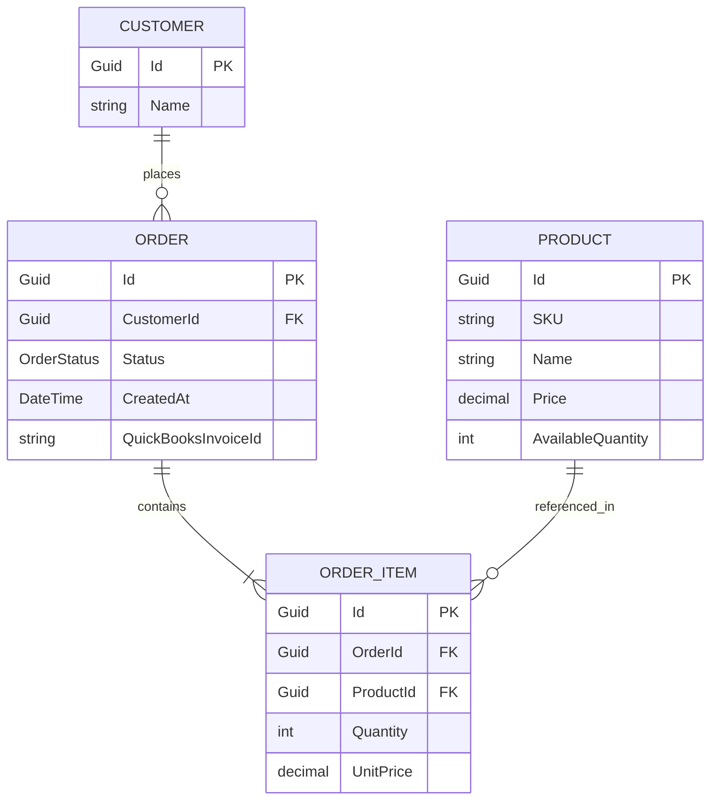

# WarehouseFlow - Warehouse Fulfillment & Invoicing System

**WarehouseFlow** is an enterprise-grade full-stack MVP designed for warehouse operations, inventory tracking, order fulfillment lifecycle management, and automated accounting integration with QuickBooks.

---

## 🚀 Key Features

- **Real-Time Fulfillment Dashboard**: Live KPI cards tracking Total Orders, Picking Queue, Shipped Status, Invoiced Count, Total SKUs, and Revenue.
- **Strict Order Lifecycle Workflow**: State machine progressing from `Created` ➔ `Picking` ➔ `Packed` ➔ `Shipped` ➔ `Invoiced`. State transitions strictly enforce operational rules and inventory updates.
- **Automated Inventory Stock Decrement**: Picking an order automatically deducts stock for each item from the product catalog.
- **QuickBooks Accounting Integration (Mocked)**: Idempotent invoice generation (`WF-ORD-{Id}` ➔ `INV-XXXX`) with simulated 1-second network latency and persistence.
- **Order Manifest Creation**: Interactive modal allowing users to create new fulfillment orders, select customers, adjust product quantities with `+`/`-` controls, and view live subtotal calculations.
- **Master Data Management**: Full CRUD management pages for **Customer Accounts** and **Products Catalog** (Boxes, Pallets, Tapes, custom SKUs).

---

## 🛠️ Tech Stack

### Backend Stack
| Technology | Version / Tool | Purpose |
| :--- | :--- | :--- |
| **Framework** | ASP.NET Core Web API (.NET 8) | High-performance RESTful API service |
| **ORM** | Entity Framework Core 8.0 | Code-first database mapping & migrations |
| **Database** | SQLite (`warehouseflow.db`) | Lightweight, self-contained relational storage |
| **Documentation** | Swagger / OpenAPI UI | Interactive API documentation at `/swagger` |
| **Integration** | `IQuickBooksService` | Mocked QuickBooks invoice generation service |

### Frontend Stack
| Technology | Version / Tool | Purpose |
| :--- | :--- | :--- |
| **Library** | React 18 + TypeScript | Component-driven, type-safe user interface |
| **Build Tool** | Vite 8 | Fast HMR & production bundler |
| **Styling** | Tailwind CSS 3 | Modern glassmorphism dark-theme aesthetics |
| **Icons** | Lucide React | Clean, intuitive icons |
| **Notifications** | Custom Toast Context | Visual success & error alert feedback |

---

## 📐 System Architecture

The following diagram illustrates the separation of concerns between the React Vite SPA frontend, the ASP.NET Core REST API backend, the SQLite database, and the mocked QuickBooks service.

```mermaid
graph TD
    subgraph Frontend ["React SPA (Vite + TypeScript + Tailwind CSS)"]
        UI[User Interface / Glassmorphic UI]
        Dash[Dashboard View]
        OrdQueue[Order Queue View]
        OrdDetail[Order Progression Timeline]
        CustPage[Customers Page]
        ProdPage[Products Catalog Page]
        Modal[Create Order Modal]
        APIClient[API Utility Client - client.ts]
    end

    subgraph Backend ["ASP.NET Core Web API (.NET 8)"]
        DashCtrl[DashboardController]
        OrdCtrl[OrdersController]
        CustCtrl[CustomersController]
        ProdCtrl[ProductsController]
        QBService[QuickBooksService (IQuickBooksService)]
        EF[Entity Framework Core DbContext]
    end

    subgraph Database ["Persistence Layer"]
        DB[(SQLite - warehouseflow.db)]
    end

    subgraph External ["External Services"]
        QB[QuickBooks Accounting API (Mocked)]
    end

    UI --> Dash
    UI --> OrdQueue
    UI --> OrdDetail
    UI --> CustPage
    UI --> ProdPage
    UI --> Modal

    Dash --> APIClient
    OrdQueue --> APIClient
    OrdDetail --> APIClient
    CustPage --> APIClient
    ProdPage --> APIClient
    Modal --> APIClient

    APIClient -- HTTP / REST --> DashCtrl
    APIClient -- HTTP / REST --> OrdCtrl
    APIClient -- HTTP / REST --> CustCtrl
    APIClient -- HTTP / REST --> ProdCtrl

    DashCtrl --> EF
    OrdCtrl --> EF
    CustCtrl --> EF
    ProdCtrl --> EF
    OrdCtrl --> QBService

    QBService -. 1s Delay & Idempotent Sync .-> QB
    EF --> DB
```

---

## 🔄 Order Fulfillment Workflow Flowchart

Orders progress through a strict 5-stage lifecycle state machine. State transitions validate prerequisites before updating the database.



---

## 🗄️ Database ER Diagram & Schema



### Table Definitions

#### `Customers`
| Field | Type | Constraint | Description |
| :--- | :--- | :--- | :--- |
| `Id` | `Guid` | Primary Key | Unique customer identifier |
| `Name` | `string` | Required | Customer business name |

#### `Products`
| Field | Type | Constraint | Description |
| :--- | :--- | :--- | :--- |
| `Id` | `Guid` | Primary Key | Unique product identifier |
| `SKU` | `string` | Required, Unique | Stock Keeping Unit code (e.g. `BOX-HVY-001`) |
| `Name` | `string` | Required | Display name of the product |
| `Price` | `decimal` | Non-negative | Unit selling price ($ USD) |
| `AvailableQuantity` | `int` | Non-negative | Current stock count in warehouse |

#### `Orders`
| Field | Type | Constraint | Description |
| :--- | :--- | :--- | :--- |
| `Id` | `Guid` | Primary Key | Unique order identifier |
| `CustomerId` | `Guid` | Foreign Key | References `Customers.Id` |
| `Status` | `int (Enum)` | Required | `0=Created`, `1=Picking`, `2=Packed`, `3=Shipped`, `4=Invoiced` |
| `CreatedAt` | `DateTime` | Required | Order creation timestamp (UTC) |
| `QuickBooksInvoiceId` | `string` | Nullable | QuickBooks generated invoice number (e.g. `INV-1048`) |

#### `OrderItems`
| Field | Type | Constraint | Description |
| :--- | :--- | :--- | :--- |
| `Id` | `Guid` | Primary Key | Unique line item identifier |
| `OrderId` | `Guid` | Foreign Key | References `Orders.Id` |
| `ProductId` | `Guid` | Foreign Key | References `Products.Id` |
| `Quantity` | `int` | > 0 | Ordered unit count |
| `UnitPrice` | `decimal` | Non-negative | Unit price captured at time of order creation |

---

## 📡 REST API Endpoint Reference

| Method | Endpoint | Description | Request Body / Parameters | Response |
| :--- | :--- | :--- | :--- | :--- |
| `GET` | `/api/dashboard` | Returns summary KPI metrics | None | `DashboardDto` |
| `GET` | `/api/orders` | List all orders with customer names & item totals | None | `List<OrderDto>` |
| `GET` | `/api/orders/{id}` | Get detailed single order with nested line items | `id` (Guid) | `OrderDto` |
| `POST` | `/api/orders` | Create a new fulfillment order | `CreateOrderDto` | `201 Created` (`OrderDto`) |
| `POST` | `/api/orders/{id}/pick` | Advance status to `Picking` & decrement stock | `id` (Guid) | `OrderDto` |
| `POST` | `/api/orders/{id}/pack` | Advance status to `Packed` (requires `Picking`) | `id` (Guid) | `OrderDto` / `400 Bad Request` |
| `POST` | `/api/orders/{id}/ship` | Advance status to `Shipped` (requires `Packed`) | `id` (Guid) | `OrderDto` / `400 Bad Request` |
| `POST` | `/api/orders/{id}/invoice` | Generate QuickBooks invoice & mark `Invoiced` | `id` (Guid) | `OrderDto` |
| `GET` | `/api/customers` | List all customers | None | `List<CustomerDto>` |
| `POST` | `/api/customers` | Create new customer account | `CreateCustomerDto` | `201 Created` (`CustomerDto`) |
| `PUT` | `/api/customers/{id}` | Update customer name | `UpdateCustomerDto` | `CustomerDto` |
| `DELETE` | `/api/customers/{id}` | Delete customer account | `id` (Guid) | `204 No Content` / `400 Bad Request` |
| `GET` | `/api/products` | List all products in catalog | None | `List<ProductDto>` |
| `POST` | `/api/products` | Add new product SKU to catalog | `CreateProductDto` | `201 Created` (`ProductDto`) |
| `PUT` | `/api/products/{id}` | Update product details or stock level | `UpdateProductDto` | `ProductDto` |
| `DELETE` | `/api/products/{id}` | Delete product from catalog | `id` (Guid) | `204 No Content` / `400 Bad Request` |

---

## ⚡ Quick Start & Local Setup Guide

### Prerequisites
- [.NET 8 SDK](https://dotnet.microsoft.com/download/dotnet/8.0)
- [Node.js (v18+)](https://nodejs.org/) & `npm`

### 1. Clone & Setup Backend
```bash
cd backend
dotnet restore
dotnet run
```
- **Backend Port**: `http://localhost:5000`
- **Swagger Documentation**: `http://localhost:5000/swagger`
- *Note: On initial startup, SQLite database `warehouseflow.db` is auto-created and populated with seed customers, products, and sample orders.*

### 2. Setup & Launch Frontend
```bash
cd frontend
npm install
npm run dev
```
- **Frontend Port**: `http://localhost:5173`
